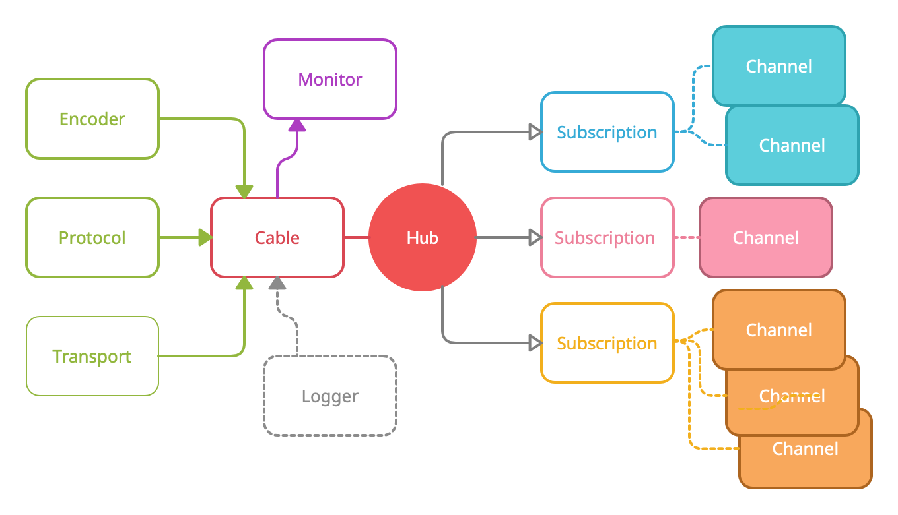

# AnyCable client architecture

AnyCable client consists of multiple building blocks that could be replaced independently of each other (unless interfaces are satisfied). The core entities are _Cable_, _Transport_, _Protocol_, _Encoder_, and _Channels_. We also have _Logger_, _Hub_, and _Monitor_.

Check out also the [`createCable`][create-cable] function implementation to see how all the pieces are glued together.

The diagram below shows the data flow through the client:

## Cable

_Cable_ acts as a container for all other components. It's also responsible for data _from_ Transport to Channels and vice versa. Cable implements _Consumer_ (for Protocol) and _Receiver_ (for Channel) interfaces (see data flow above).

## Transport

_Transport_ is responsible for sending/receiving data from/to a server. That's it. No knowledge of data format/serialization or whatever.

## Encoder

_Encoder_ is responsible for serializing/deserializing data from Protocol to Transport format. One protocol may be represented via different serialization formats, e.g., JSON, Msgpack. Encoder aims to localize this difference, so other parts shouldn't care about it.

## Protocol

_Protocol_ translates library models into a wire protocol format (e.g., Action Cable). AnyCable client uses its own internal model not coupled with any particular server protocol.

## Channel

_Channel_ is a business-logic abstraction (similar to Action Cable Channel). It only needs a _Receiver_ (implemented by Cable) to perform _remote_ actions.

## Hub

_Hub_ is a part of Cable, which keeps track of _Subscriptions_. Subscription represents a server-side channel instance and MAY have multiple client-side Channel instances attached.Incoming data go to Hub, which transmits it further to a designated Subscription, which in its turn notify channels. One interesting feature of Hub is that it helps to deal with race conditions when subscribing to and unsubscribing from channels.

## Monitor

_Monitor_ is responsible for keeping Cable connected. First, it tracks Ping messages and triggers reconnection if they're missing. Secondly, it tries to reconnect when an unexpected disconnect occurs (using a configurable backoff strategy).

[create-cable]: https://github.com/anycable/anycable-client/blob/master/packages/core/create-cable/index.js
